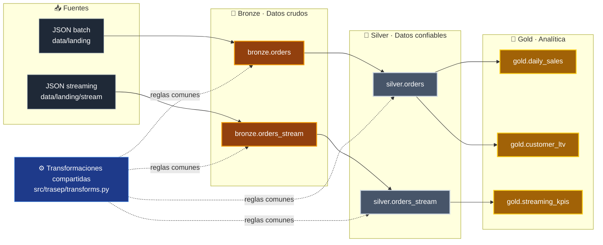
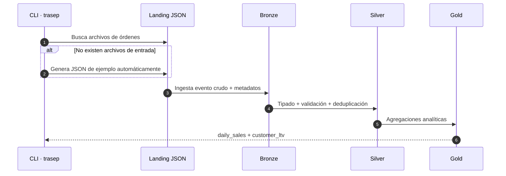
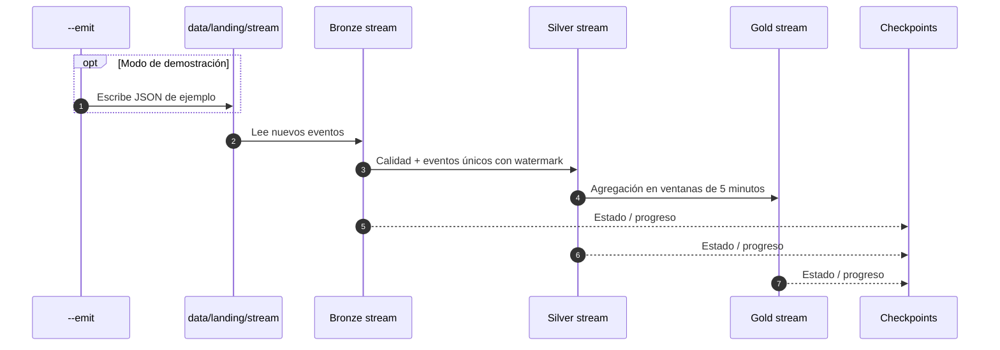
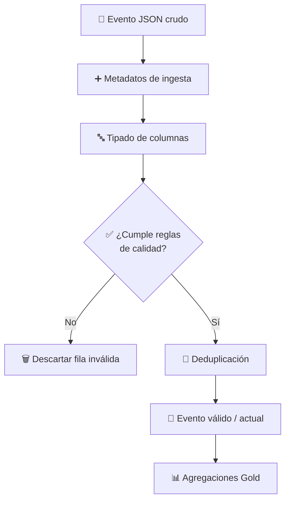
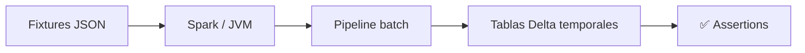
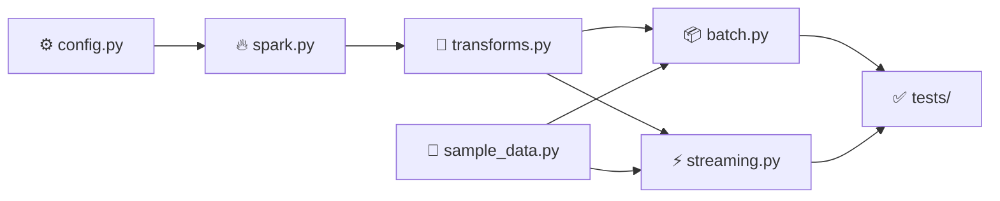
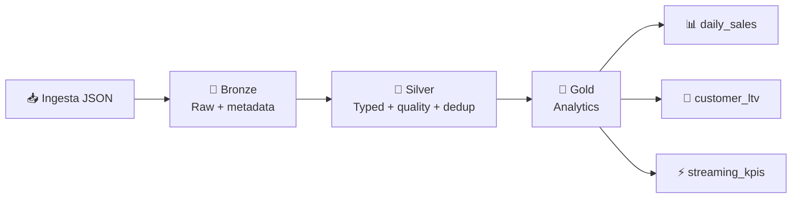

<div align="center">

# 🚀 Trasep Lakehouse

### Pipeline de datos moderno con PySpark + Delta Lake

Arquitectura **Medallion (Bronze → Silver → Gold)** para procesar órdenes en **batch y streaming**, reutilizando las mismas transformaciones y produciendo contratos de datos comparables.

<p>
  
  
  
  
  
  
</p>

**JSON → Bronze → Silver → Gold → Analítica**

</div>

---

## 📌 Descripción

**Trasep Lakehouse** es un proyecto de ingeniería de datos construido con **PySpark** y **Delta Lake** que implementa una arquitectura Medallion para transformar eventos de órdenes desde archivos JSON hasta datasets listos para analítica.

El proyecto cubre dos rutas de procesamiento:

- **Batch:** procesa órdenes almacenadas en archivos de entrada.
- **Streaming:** procesa eventos de órdenes a medida que llegan.

Ambas rutas comparten la lógica de transformación para mantener reglas de negocio y contratos de datos consistentes entre **Silver** y **Gold**.

### ¿Qué produce?

- Ventas diarias por fecha, país, categoría y canal.
- **Customer LTV** por cliente y país.
- KPIs de streaming agregados en ventanas de 5 minutos.
- Datos tipados, deduplicados y sometidos a reglas de calidad.
- Tablas Delta organizadas por capas **Bronze, Silver y Gold**.

---

## 🧭 Contenido

- [Arquitectura](#-arquitectura)
- [Flujo de datos](#-flujo-de-datos)
- [Capas del Lakehouse](#-capas-del-lakehouse)
- [Stack tecnológico](#-stack-tecnológico)
- [Requisitos](#-requisitos)
- [Instalación](#-instalación)
- [Ejecución batch](#-ejecución-batch)
- [Ejecución streaming](#-ejecución-streaming)
- [Salidas generadas](#-salidas-generadas)
- [Pruebas](#-pruebas)
- [Estructura del proyecto](#-estructura-del-proyecto)
- [Decisiones de diseño](#-decisiones-de-diseño)
- [Notas para Windows](#-notas-para-windows)

---

## 🏗 Arquitectura



### Vista conceptual

```text
                           ┌─────────────────────────────┐
                           │     Transformaciones       │
                           │         compartidas         │
                           └──────────────┬──────────────┘
                                          │
              ┌───────────────────────────┴───────────────────────────┐
              │                                                       │
         RUTA BATCH                                             RUTA STREAMING
              │                                                       │
      JSON de entrada                                         JSON entrante
              │                                                       │
              ▼                                                       ▼
      bronze.orders                                         bronze.orders_stream
              │                                                       │
              ▼                                                       ▼
      silver.orders                                         silver.orders_stream
          ┌───┴────┐                                                  │
          │        │                                                   ▼
          ▼        ▼                                          gold.streaming_kpis
 daily_sales  customer_ltv
```

> [!IMPORTANT]
> La idea central del proyecto es evitar mantener dos implementaciones distintas de las reglas de transformación. Batch y streaming reutilizan lógica común para producir resultados consistentes.

---

## 🔄 Flujo de datos

### Pipeline batch



### Pipeline streaming



---

## 🥇 Capas del Lakehouse

| Capa | Tabla | Granularidad | Responsabilidad |
|---|---|---|---|
| 🥉 **Bronze** | `orders` / `orders_stream` | 1 evento crudo | Conserva el evento original junto con archivo fuente, timestamp de ingesta y fecha del evento. |
| 🥈 **Silver** | `orders` / `orders_stream` | 1 evento válido | Descarta filas inválidas. En batch identifica el evento más reciente por `order_id`; en streaming mantiene eventos únicos usando watermark. |
| 🥇 **Gold** | `daily_sales` | fecha + país + categoría + canal | Calcula ventas diarias excluyendo órdenes actuales canceladas o devueltas. |
| 🥇 **Gold** | `customer_ltv` | cliente + país | Calcula demanda pagada acumulada por cliente. |
| 🥇 **Gold** | `streaming_kpis` | ventana de 5 min + país + canal | Genera agregaciones de streaming utilizando watermark. |

### Transformación conceptual



---

## 🧰 Stack tecnológico

| Tecnología | Uso dentro del proyecto |
|---|---|
| **Python 3.10+** | Código de aplicación, configuración y ejecución de pipelines. |
| **PySpark** | Procesamiento distribuido de datos batch y streaming. |
| **Apache Spark Structured Streaming** | Procesamiento incremental de archivos y agregaciones con watermark. |
| **Delta Lake** | Persistencia de las capas del Lakehouse mediante tablas Delta. |
| **JDK 17** | Runtime requerido por Spark. |
| **Pytest** | Pruebas automatizadas del pipeline. |
| **YAML** | Configuración de rutas, Spark, streaming y reglas de calidad. |

---

## ✅ Requisitos

Antes de ejecutar el proyecto verifica que tengas:

- **Python 3.10 o superior**.
- **JDK 17**.
- `JAVA_HOME` apuntando al JDK correcto.
- En Windows, los binarios nativos de Hadoop requeridos por Spark.

> [!NOTE]
> `src/trasep/spark.py` prioriza `C:\Program Files\Java\jdk-17` cuando esa instalación existe.

---

## ⚡ Instalación

### 1. Crear el entorno virtual

```powershell
python -m venv .venv
```

### 2. Activarlo en PowerShell

```powershell
.\.venv\Scripts\Activate.ps1
```

### 3. Instalar el proyecto y dependencias de desarrollo

```powershell
pip install -e ".[dev]"
```

Con esto el paquete queda instalado en modo editable, por lo que los cambios realizados dentro de `src/` quedan disponibles sin reinstalar el proyecto en cada modificación.

---

## 📦 Ejecución batch

### Generar datos de ejemplo

```powershell
python -m trasep seed
```

### Ejecutar el pipeline

```powershell
python -m trasep batch
```

> [!TIP]
> Si no existen archivos en la zona de landing, el comando `batch` genera automáticamente JSON de ejemplo antes de procesar el pipeline.

### Flujo esperado

```text
JSON
  │
  ▼
Bronze
  │
  ▼
Silver
  ├────────► Gold · daily_sales
  └────────► Gold · customer_ltv
```

---

## ⚡ Ejecución streaming

Para iniciar las consultas de streaming y, al mismo tiempo, generar eventos JSON de demostración:

```powershell
python -m trasep stream --emit --seconds 45
```

### ¿Qué hace `--emit`?

Mientras se ejecutan las consultas de **Bronze**, **Silver** y **Gold**, `--emit` escribe archivos JSON de ejemplo en:

```text
data/landing/stream
```

Los checkpoints se almacenan en:

```text
data/checkpoints
```

### Mantener el proceso activo hasta detenerlo manualmente

```powershell
python -m trasep stream --seconds 0
```

> [!NOTE]
> Con `--seconds 0`, el proceso permanece activo hasta que lo detengas manualmente.

---

## 📂 Salidas generadas

Después de ejecutar el pipeline batch encontrarás las tablas en:

```text
data/
└── lakehouse/
    ├── bronze/
    │   └── orders/
    ├── silver/
    │   └── orders/
    └── gold/
        ├── daily_sales/
        └── customer_ltv/
```

| Dataset | Ruta | Uso |
|---|---|---|
| Bronze Orders | `data/lakehouse/bronze/orders` | Eventos crudos con metadatos de ingesta. |
| Silver Orders | `data/lakehouse/silver/orders` | Eventos válidos, tipados y deduplicados. |
| Daily Sales | `data/lakehouse/gold/daily_sales` | Ventas diarias listas para analítica. |
| Customer LTV | `data/lakehouse/gold/customer_ltv` | Valor/demanda acumulada por cliente. |

---

## 🧪 Pruebas

Ejecuta toda la suite con:

```powershell
python -m pytest
```

### Estrategia de pruebas

Las pruebas de Spark leen **fixtures JSON** en lugar de construir los datos con `createDataFrame`. Esto permite que las ejecuciones locales en Windows permanezcan sobre la ruta de ejecución de la JVM.

Además:

```text
tests/test_batch_pipeline.py
```

crea tablas Delta temporales para validar el pipeline batch.



---

## 🗂 Estructura del proyecto

```text
.
├── config/
│   └── pipeline.yaml              # Rutas, Spark, streaming y reglas de calidad
│
├── src/
│   └── trasep/
│       ├── config.py              # Configuración tipada
│       ├── spark.py               # SparkSession con soporte Delta
│       ├── transforms.py          # Lógica Bronze / Silver / Gold compartida
│       ├── sample_data.py         # Generador local de JSON
│       └── pipelines/
│           ├── batch.py           # Pipeline batch
│           └── streaming.py       # Pipeline streaming
│
└── tests/                         # Pruebas automatizadas
```

---

## 🧠 Decisiones de diseño

### 1. Una sola lógica de transformación

Batch y streaming comparten las transformaciones centrales, reduciendo el riesgo de que una misma regla de negocio produzca resultados diferentes dependiendo del modo de ejecución.

### 2. Separación por responsabilidades



- `config.py`: configuración del pipeline.
- `spark.py`: construcción de la sesión Spark con Delta Lake.
- `transforms.py`: reglas reutilizables entre batch y streaming.
- `pipelines/`: orquestación de cada modalidad de procesamiento.
- `sample_data.py`: generación de datos locales para pruebas y demostraciones.

### 3. Arquitectura Medallion

Cada capa responde una pregunta distinta:

| Capa | Pregunta |
|---|---|
| 🥉 Bronze | **¿Qué recibimos exactamente?** |
| 🥈 Silver | **¿Qué datos son válidos y confiables?** |
| 🥇 Gold | **¿Qué necesita consumir analítica?** |

### 4. Estado en streaming

La ruta streaming utiliza **watermarks** y checkpoints para soportar deduplicación y agregaciones temporales sin tratar cada microbatch como un proceso aislado.

---

## 🪟 Notas para Windows

Spark requiere binarios nativos de Hadoop al ejecutarse localmente en Windows.

El constructor de sesión del proyecto descarga en la primera ejecución:

```text
.tools/hadoop/bin/winutils.exe
.tools/hadoop/bin/hadoop.dll
```

También fija `PYSPARK_PYTHON` al intérprete activo para que Spark utilice el mismo Python del entorno virtual.

### Comprobaciones útiles

```powershell
python --version
java -version
$env:JAVA_HOME
```

Si Spark inicia con un JDK diferente al esperado, revisa `JAVA_HOME` y confirma que apunta a **JDK 17**.

---

## 🧩 Resumen del proyecto



<div align="center">

**PySpark · Delta Lake · Medallion Architecture · Batch · Structured Streaming**

</div>
